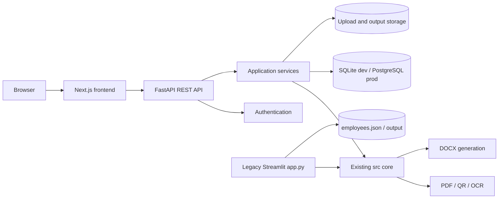
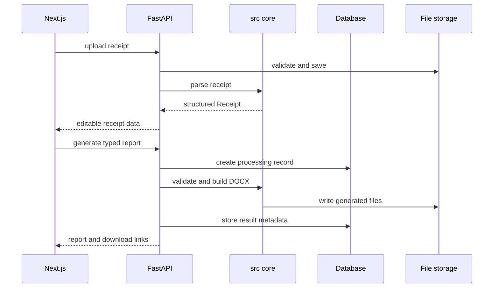

# Architecture

## Overview

Репозиторий содержит два интерфейса над одной Python business logic:

- legacy Streamlit для резервного запуска;
- Modern Web: Next.js frontend и FastAPI backend.



## Repository layout

```text
app.py, streamlit_app.py     legacy Streamlit entrypoints
src/                         shared Pydantic models, parsers and generators
backend/app/                 FastAPI routes, schemas, services and persistence
backend/tests/               API and service tests
backend/alembic/             database migrations
frontend/src/app/            Next.js routes
frontend/src/components/     application and UI components
frontend/src/features/       report, employee and history flows
frontend/src/**/*.test.*     Vitest component/unit tests
frontend/e2e/                Playwright browser tests
templates/                   existing DOCX templates
data/                        legacy employee directory and autofill profiles
storage/                     web uploads and generated files, gitignored
```

## Backend boundaries

- API routes parse HTTP input and apply authorization.
- Pydantic schemas define every public request and response.
- Services own report orchestration, uploads, history and employee operations.
- Services own focused SQLAlchemy persistence; routes do not query models directly.
- `src/` owns receipt recognition, validation, document context and DOCX generation.
- FastAPI and shared core do not import Streamlit.

## Persistence

SQLite is the local default. The same SQLAlchemy models support PostgreSQL in production through `DATABASE_URL`.

Persistent entities:

- users and roles;
- employees;
- uploaded receipt metadata;
- reports and validated input snapshots;
- generated file metadata.

Binary files remain in configurable filesystem storage. Database rows never contain whole DOCX/PDF binaries.

## Generation pipeline



## Security model

- email/password login with Argon2 hashes;
- signed JWT in an HttpOnly cookie;
- `admin`, `user` and `viewer` roles;
- upload extension, MIME, file-signature, filename and size validation;
- per-report storage directories;
- configured CORS allowlist;
- no runtime package installation in backend request handlers;
- no absolute developer-machine paths in application source.

## Deployment

Docker Compose provides PostgreSQL, backend and production Next.js. A Linux VPS places nginx/HTTPS in front of the frontend; Next.js proxies same-origin `/api` requests to FastAPI.
